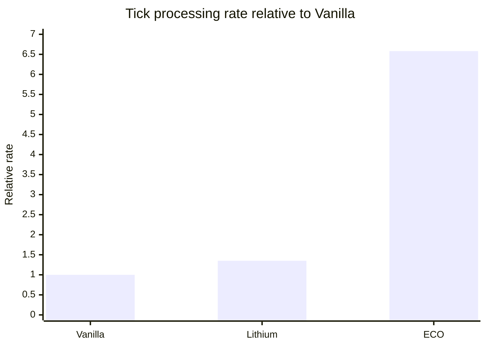
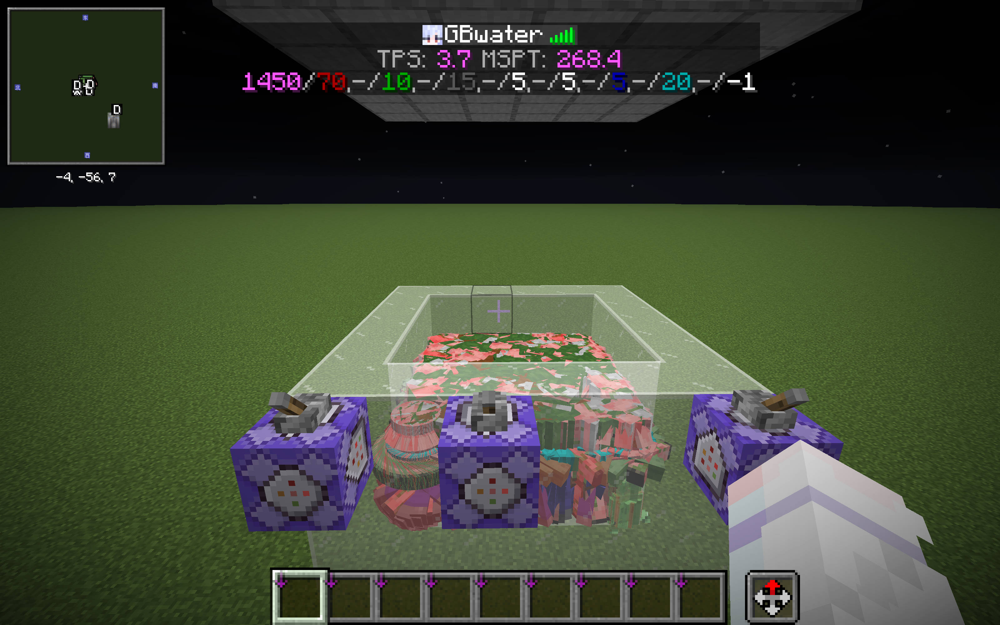
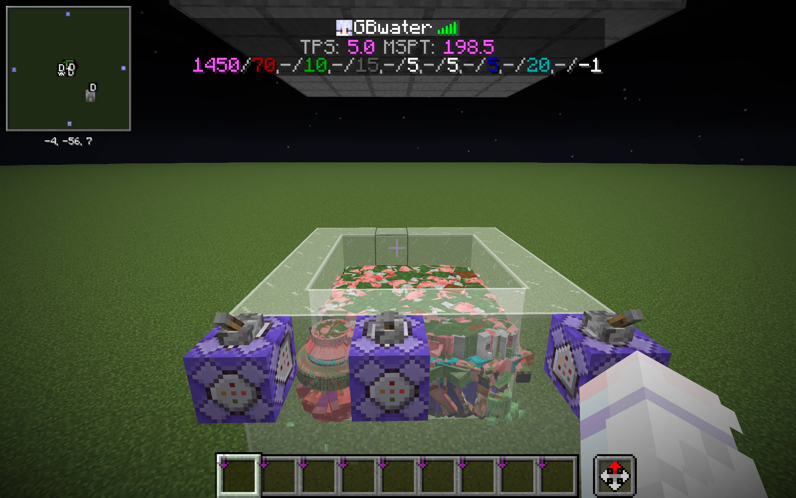
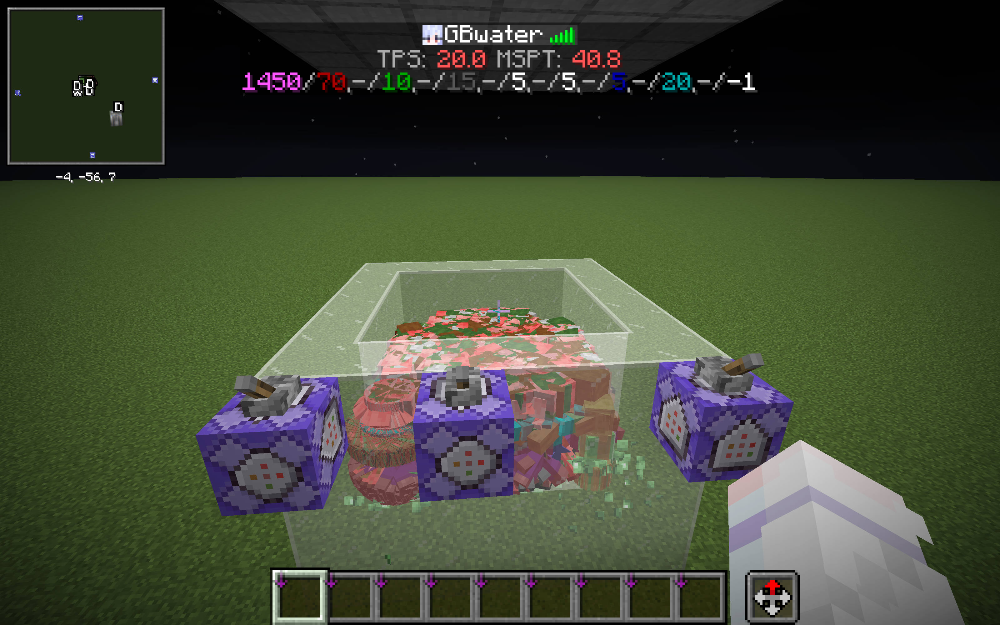

# Entity Collision Optimizer

English | [简体中文](README_zh.md)

Entity Collision Optimizer is a free and open-source Fabric mod for Minecraft 26.2. It speeds up server-side entity pushing and movement collision while its default backend preserves vanilla collision behavior.

The mod is enabled as soon as it is installed. It works on dedicated and integrated servers, and connecting clients do not need to install it.

**In the dense entity comparison below, Entity Collision Optimizer processes ticks at 6.58× the Vanilla rate and 4.87× the Lithium rate.**

> Entity Collision Optimizer is currently in alpha. Back up your world and test your exact mod set before deploying it to a production server.

## Why use Entity Collision Optimizer?

Crowded mob farms, transport systems, and other entity-heavy builds can spend a large share of their tick time finding nearby entities, checking bounding boxes, applying pushes, and resolving movement against blocks. Entity Collision Optimizer focuses on that work alone. It does not attempt to optimize AI, pathfinding, chunk generation, networking, or client rendering, so the improvement you see depends on how much collision work your server performs.

This is not a collision limiter or an approximate simulation. With the default ordered backend, vanilla entities produce the same candidates in the same order, run the same collision rules, and publish each velocity or movement update at the same point as Mojang's implementation. The algorithm does not change with entity density and never drops candidates.

## In-game comparison

The screenshots below use the same dense zombified-piglin enclosure and the same test conditions. Entity Collision Optimizer was run with `vanillaOrder=false`, which removes the work performed solely to reproduce vanilla's entity candidate order. The live tick overlay reports the following results:

| Setup | MSPT | Speed vs Vanilla | MSPT reduction vs Vanilla |
| --- | ---: | ---: | ---: |
| Vanilla | 268.4 | 1.00× | — |
| Lithium | 198.5 | 1.35× | 26.0% |
| Entity Collision Optimizer | 40.8 | **6.58×** | **84.8%** |

In this scene, Entity Collision Optimizer reduces MSPT by **84.8% versus Vanilla** and **79.4% versus Lithium**, bringing the server below Minecraft's 50 MSPT budget.



<table>
  <tr>
    <td width="33%" align="center"><strong>Vanilla</strong><br>268.4 MSPT</td>
    <td width="33%" align="center"><strong>Lithium</strong><br>198.5 MSPT</td>
    <td width="33%" align="center"><strong>ECO</strong><br>40.8 MSPT</td>
  </tr>
  <tr>
    <td width="33%" align="center"></td>
    <td width="33%" align="center"></td>
    <td width="33%" align="center"></td>
  </tr>
</table>

Disabling `vanillaOrder` does not change redstone update order or block logic, so it does not affect most redstone machines. It can change the outcome of machines that depend on the exact order of entity pushes, collision timing, or entity trajectories; test those designs with the option disabled before deployment.

These values are live snapshots from this particular scene, not a multi-run statistical benchmark. Absolute performance depends on hardware, JVM, mod set, and workload; the screenshots are included to make this specific comparison directly inspectable.

## How it works

Minecraft stores entities in sections. A collision query walks the relevant sections, visits Java objects, checks their bounding boxes and builds the data needed by the pushing or movement code. This is simple and flexible, but the object access, temporary allocations and repeated preparation become expensive when many entities occupy a small area.

Entity Collision Optimizer keeps a native collision context for each dimension and updates it as entities are tracked, moved, transferred between dimensions, or removed. A persistent fine-grained XYZ grid narrows each query to nearby entities. In the default backend, a second section index restores Minecraft's section traversal and insertion order after that spatial filtering, so preserving vanilla order does not require sorting every result.

Position, velocity, bounding-box and synchronization state used by collision code live in compact shared off-heap tables. Java and native code operate on the same state, while Java objects such as `Vec3` are materialized only when Java code actually reads them. Candidate bounds use a SoA layout so hot AABB loops make effective use of CPU caches and AVX2.

For entity pushing, one native query performs spatial and rule filtering. Consecutive pairs that use Minecraft's standard push formula are then evaluated as a batch, in order, with each pair's velocity changes visible to the next pair. Entity-specific vanilla callbacks still run at their original point. For movement, a maintained block mask skips positions that cannot collide; Java still resolves context-sensitive `VoxelShape` values, while native code performs the bulk geometry clipping, step calculation, and movement integration.

The FFM boundary therefore carries a complete query, push run, or movement operation instead of bouncing between Java and native code for every candidate. Gravity, friction, fall handling, fluids, damage, explosions, block effects, and world callbacks remain in Minecraft's normal Java logic. See [native/README.md](native/README.md) for the native module boundaries.

## Requirements

| Component | Requirement |
| --- | --- |
| Minecraft | 26.2 |
| Mod loader | Fabric Loader 0.17.0 or newer |
| Dependency | A Minecraft 26.2-compatible Fabric API 0.145.4 or newer |
| Java | 25 |
| Operating system | Windows, Linux, or macOS |
| Processor | x86-64 with AVX2 |

Release JARs contain native libraries for x86-64 Windows, Linux, and macOS. ARM64 is not currently supported.

## Installation

1. Install Fabric Loader and Fabric API.
2. Download the JAR for Minecraft 26.2 from [GitHub Releases](https://github.com/water2004/EntityCollisionOptimizer/releases) and place it in the instance's `mods` directory.

No additional JVM arguments are required on the supported Java 25 runtime. The official Minecraft 26.2 launcher already enables native access. A dedicated server started manually without that option may print Java's native-access warning once, but Java 25 still allows the operation and the mod continues to work.

Server administrators who want to suppress that warning may optionally add:

```text
--enable-native-access=ALL-UNNAMED
```

An unsupported native platform or an FFM initialization failure is reported as an error. The mod will not silently fall back to another implementation.

## Configuration

Use `/eco` to show the active backend, FFM state, and entity-order mode. Use `/eco vanillaOrder true|false` to select the mode for the next restart:

- `true` (default) preserves Minecraft's entity candidate order and update semantics.
- `false` selects the unordered native backend and removes all work needed solely to reproduce vanilla order. It still finds and deduplicates the complete candidate set, but push order and the resulting state may differ from vanilla. Redstone update order and block logic are unchanged, so most redstone machines are unaffected; machines that rely on exact entity push order or trajectories should be tested separately.

The backend is selected at startup, so changing the mode does not affect the running server and takes effect after a restart.

## Compatibility

- Lithium and Carpet can be installed alongside Entity Collision Optimizer. When enabled, this mod owns the overlapping server collision paths instead of running both implementations.
- Carpet's `maxEntityCollisions` limit is intentionally ignored. Limiting the number of collision candidates is outside this mod's scope. Vanilla's `maxEntityCramming` damage rule still applies.
- The mod does not change the save format or register content that must be synchronized to clients.
- Vanilla entities are the compatibility target. Custom entities or mods that directly replace the same collision paths are not currently guaranteed to work.

Please report reproducible problems through the [issue tracker](https://github.com/water2004/EntityCollisionOptimizer/issues).

## Building and testing

Use Java 25 and the included Gradle Wrapper:

```powershell
./gradlew.bat build
./gradlew.bat runGameTest -Pparity
```

The differential GameTest suite compares vanilla and optimized results across entity pushing, players, vehicles, projectiles, explosions, pistons, slime and honey blocks, fluids, bubble columns, ice, irregular block shapes, chunk-loading boundaries, and dimension transfers.

Benchmarks are opt-in through `-Pbenchmark`; a normal build does not start a benchmark server. Use `-PcompatModsDir=<directory>` to add extra mods to a test run.

Building a complete release JAR with all native targets currently requires Windows. On Linux or macOS, use `./gradlew compileJava` to check the Java sources. Build artifacts are written to `build/libs`; version and tag conventions are documented in [RELEASE.md](RELEASE.md).

## License

Entity Collision Optimizer is available under the [MIT License](LICENSE).

This project originated from [Accelerated Recoiling](https://github.com/water2004/AcceleratedRecoiling), originally released under the MIT License by wiyuka. Entity Collision Optimizer is subsequently refactored and maintained by water2004.
