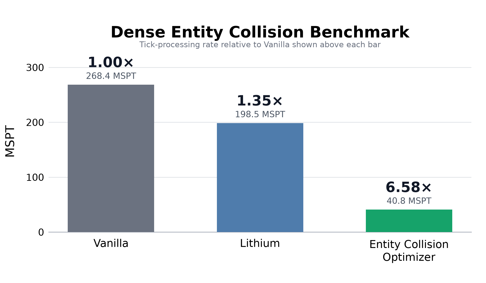
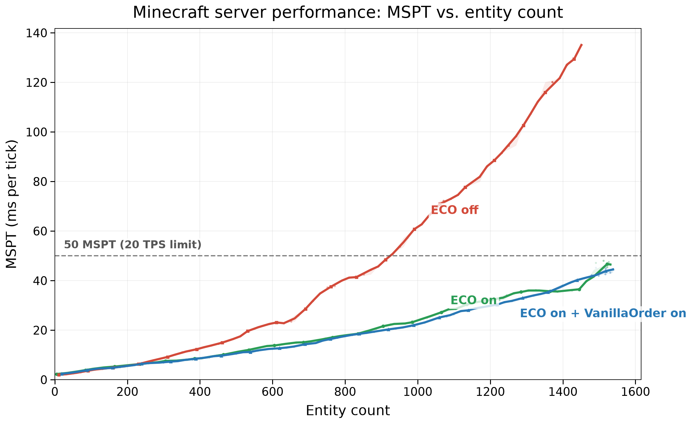

> Minecraft 1.21.1 backport. See [PORTING_1.21.1.md](PORTING_1.21.1.md) for build instructions and verification scope. Performance figures below are historical upstream results, not 1.21.1 benchmarks.

<p align="center">
  
</p>

<h1 align="center">Entity Collision Optimizer</h1>

<p align="center">Vanilla-accurate entity collision acceleration for Minecraft 1.21.1 Fabric servers.</p>

<p align="center"><strong>English</strong> | <a href="README_zh.md">简体中文</a></p>

---

Entity Collision Optimizer is a server-side Fabric mod for Minecraft 1.21.1 that uses a C++ native backend to accelerate entity queries, pushing, and movement collision while **preserving vanilla entity-collision behavior**. Install it and it works; connecting clients do not need the mod.

## Why use Entity Collision Optimizer?

Crowded mob farms, transport systems, and other entity-heavy builds can spend a large share of their tick time finding nearby entities, checking bounding boxes, applying pushes, and resolving movement against blocks. Entity Collision Optimizer focuses on that work alone. It does not attempt to optimize AI, pathfinding, chunk generation, networking, or client rendering, so the improvement you see depends on how much collision work your server performs.

This is not a collision limiter or an approximate simulation. Vanilla entities produce the same candidates in the same order, run the same collision rules, and publish each velocity or movement update at the same point as Mojang's implementation. The algorithm does not change with entity density and never drops candidates.

## In-game comparison

The screenshots below use the same dense zombified-piglin enclosure and the same test conditions. The ECO result was recorded with an earlier, now-removed unordered backend and is retained as historical performance data; it does not represent the current ordered-only release. The live tick overlay reported:

| Setup | MSPT | Speed vs Vanilla | MSPT reduction vs Vanilla |
| --- | ---: | ---: | ---: |
| Vanilla | 268.4 | 1.00× | — |
| Lithium | 198.5 | 1.35× | 26.0% |
| Entity Collision Optimizer | 40.8 | **6.58×** | **84.8%** |

In this scene, Entity Collision Optimizer reduces MSPT by **84.8% versus Vanilla** and **79.4% versus Lithium**, bringing the server below Minecraft's 50 MSPT budget.



<table>
  <tr>
    <td width="33%" align="center"><strong>Vanilla</strong><br>268.4 MSPT</td>
    <td width="33%" align="center"><strong>Lithium</strong><br>198.5 MSPT</td>
    <td width="33%" align="center"><strong>ECO</strong><br>40.8 MSPT</td>
  </tr>
  <tr>
    <td width="33%" align="center"></td>
    <td width="33%" align="center"></td>
    <td width="33%" align="center"></td>
  </tr>
</table>

### Scaling with entity count

A separate zombie stress test increased the entity count over time while sampling the in-game HUD five times per second. The solid curves below show the median MSPT for each 25-entity bin; faint points are the raw readings and the shaded regions show the interquartile range. With ECO disabled, the server crosses the 50 MSPT tick budget at roughly 924 entities. Both historical ECO configurations remain below that limit through approximately 1,500 entities, and preserving vanilla order had only a small effect in this workload.



These values are live snapshots from this particular scene, not a multi-run statistical benchmark. Absolute performance depends on hardware, JVM, mod set, and workload; the screenshots are included to make this specific comparison directly inspectable.

## How it works

Minecraft stores entities in sections. A collision query walks the relevant sections, visits Java objects, checks their bounding boxes and builds the data needed by the pushing or movement code. This is simple and flexible, but the object access, temporary allocations and repeated preparation become expensive when many entities occupy a small area.

Entity Collision Optimizer keeps a C++ native collision context for each dimension and updates it as entities are tracked, moved, transferred between dimensions, or removed. A compact section index mirrors Minecraft's section traversal and insertion order, while vectorized bounding-box checks narrow each query to intersecting entities without sorting every result.

Position, velocity, bounding-box and synchronization state used by collision code live in compact shared off-heap tables. Java and C++ native code operate on the same state, while Java objects such as `Vec3` are materialized only when Java code actually reads them. Candidate bounds use a SoA layout so hot AABB loops make effective use of CPU caches and AVX2.

For entity pushing, one native query performs spatial and rule filtering. Consecutive pairs that use Minecraft's standard push formula are then evaluated as a batch, in order, with each pair's velocity changes visible to the next pair. Entity-specific vanilla callbacks still run at their original point. For movement, a maintained block mask skips positions that cannot collide; Java still resolves context-sensitive `VoxelShape` values, while native code performs the bulk geometry clipping, step calculation, and movement integration.

The FFM boundary therefore carries a complete query, push run, or movement operation instead of bouncing between Java and native code for every candidate. Gravity, friction, fall handling, fluids, damage, explosions, block effects, and world callbacks remain in Minecraft's normal Java logic. See [native/README.md](native/README.md) for the native module boundaries.

## Requirements

| Component | Requirement |
| --- | --- |
| Minecraft | 1.21.1 |
| Mod loader | Fabric Loader 0.17.0 or newer |
| Dependency | A Minecraft 1.21.1-compatible Fabric API 0.116.7 or newer |
| Java | 22+ (tested on 25) |
| Operating system | Windows, Linux, or macOS |
| Processor | x86-64 with AVX2 |

Release JARs contain native libraries for x86-64 Windows, Linux, and macOS. ARM64 is not currently supported.

## Installation

1. Install Fabric Loader and Fabric API.
2. Build the local Minecraft 1.21.1 JAR in `build/libs` and place it in the instance's `mods` directory.

Use Java 22 or newer and add `--enable-native-access=ALL-UNNAMED` to the game/server JVM arguments. The FFM backend cannot run on Minecraft 1.21.1's usual Java 21 runtime.

Server administrators who want to suppress that warning may optionally add:

```text
--enable-native-access=ALL-UNNAMED
```

An unsupported native platform or an FFM initialization failure is reported as an error. The mod will not silently fall back to another implementation.

## Configuration

Use `/eco` to check whether the FFM backend initialized successfully. The mod has no runtime tuning options and always preserves Minecraft's entity candidate order and update semantics.

## Compatibility

- Lithium and Carpet can be installed alongside Entity Collision Optimizer. When enabled, this mod owns the overlapping server collision paths instead of running both implementations.
- Carpet's `maxEntityCollisions` limit is intentionally ignored. Limiting the number of collision candidates is outside this mod's scope. Vanilla's `maxEntityCramming` damage rule still applies.
- The mod does not change the save format or register content that must be synchronized to clients.
- Vanilla entities are the compatibility target. Custom entities or mods that directly replace the same collision paths are not currently guaranteed to work.

Please report reproducible problems through the [issue tracker](https://github.com/water2004/EntityCollisionOptimizer/issues).

## Building and testing

Run Gradle with Java 21 and install a JDK 25 compiler toolchain. Use the included Gradle Wrapper; see [PORTING_1.21.1.md](PORTING_1.21.1.md) for toolchain configuration:

```powershell
./gradlew.bat build
./gradlew.bat runGameTest -PunitTest
./gradlew.bat runGameTest -PintegrationTest
```

Unit GameTests cover focused collision contracts and deterministic edge cases. Integration GameTests run real scenarios first without the mod and then with it, requiring byte-for-byte identical traces. See [TESTING.md](TESTING.md) for the suite boundaries and commands.

Benchmarks are opt-in through `-Pbenchmark`; a normal build does not start a benchmark server. Use `-PcompatModsDir=<directory>` to add extra mods to a test run.

Building a complete release JAR with all native targets currently requires Windows. On Linux or macOS, use `./gradlew compileJava` to check the Java sources. Build artifacts are written to `build/libs`; version and tag conventions are documented in [RELEASE.md](RELEASE.md).

## License

Entity Collision Optimizer is available under the [MIT License](LICENSE).

Acknowledgements: This project was inspired by [Accelerated Recoiling](https://github.com/wiyuka-owo/AcceleratedRecoiling), but differs substantially in both its goals and implementation.
