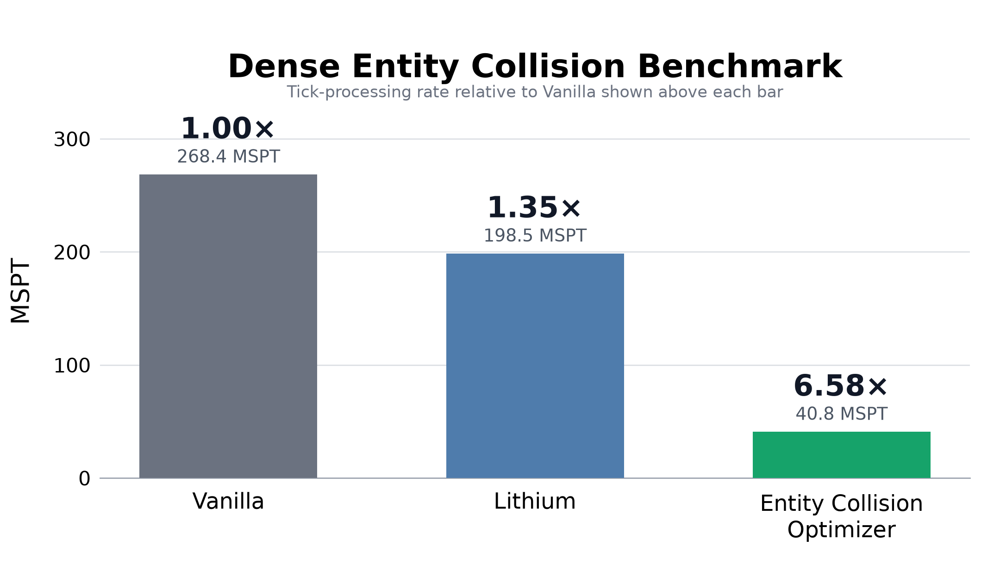
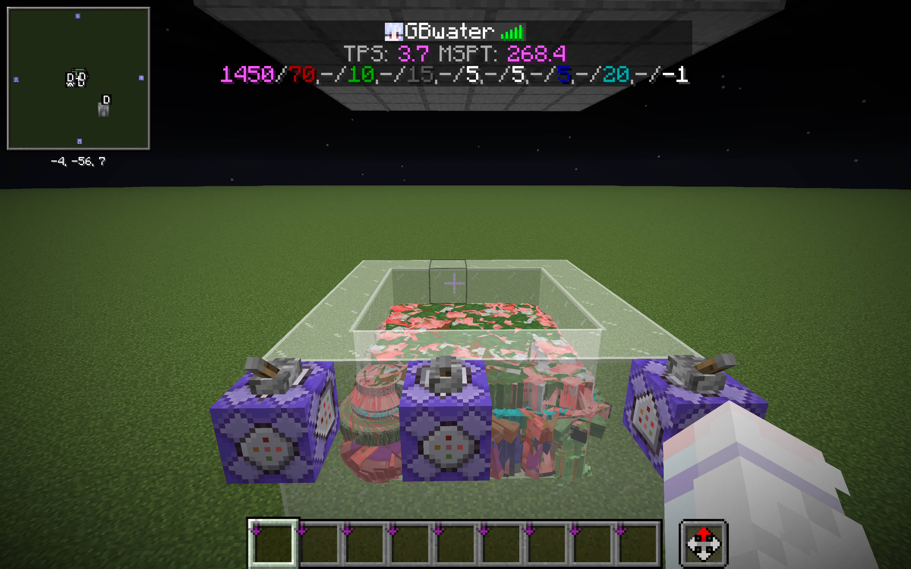
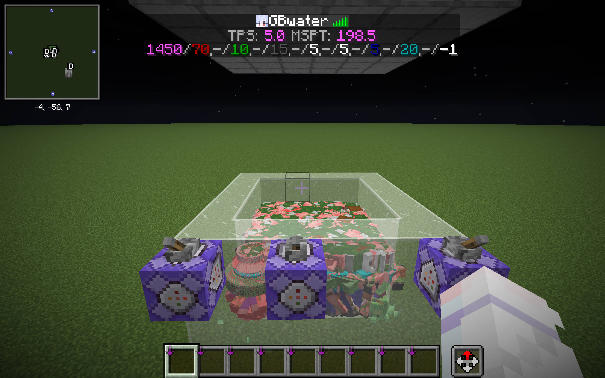
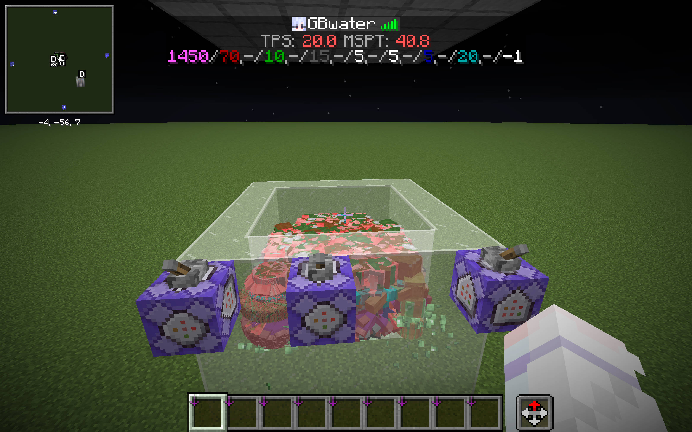
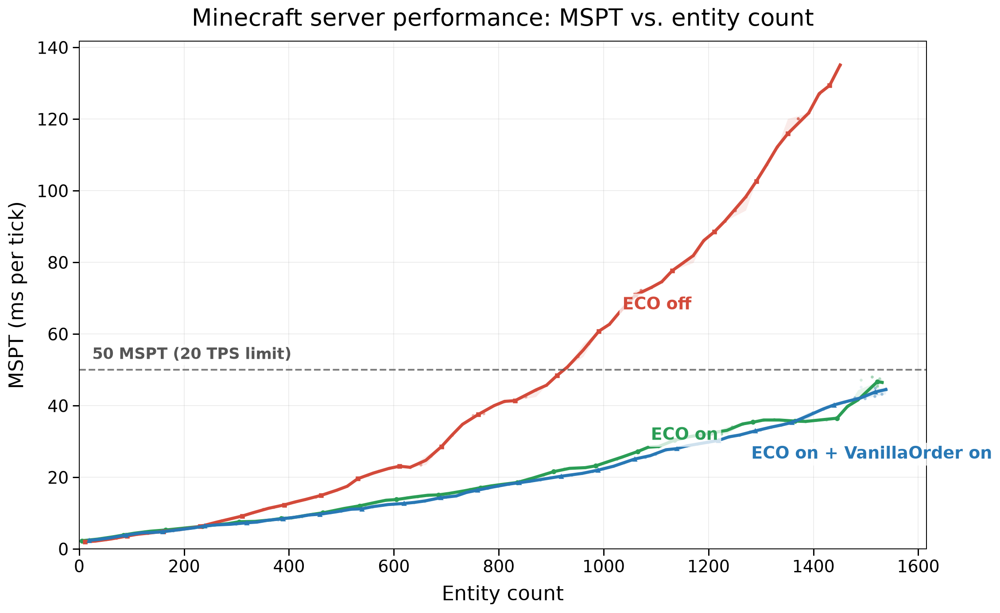

<p align="center">
  
</p>

<h1 align="center">实体碰撞优化</h1>

<p align="center">面向 Minecraft 1.21.11 Fabric 服务器的原版等价实体碰撞加速。</p>

<p align="center"><a href="README.md">English</a> | <strong>简体中文</strong></p>

---

实体碰撞优化是面向 Minecraft 1.21.11 的服务端 Fabric 模组，通过 C++ native 后端加速实体查询、相互推动和移动碰撞，同时**保持原版实体碰撞行为**。安装即生效，连接服务器的客户端无需安装。

## 为什么使用实体碰撞优化？

拥挤的刷怪塔、运输系统和其他实体密集机器，可能会把大量 tick 时间花在查找附近实体、比较碰撞箱、执行推动以及处理实体与方块的移动碰撞上。实体碰撞优化只专注于这些工作。它不优化 AI、寻路、区块生成、网络或客户端渲染，因此实际收益取决于实体碰撞在服务器负载中的占比。

这不是碰撞数量限制器，也不是近似模拟。原版实体会产生相同的候选集合和候选顺序，执行相同的碰撞规则，并在与 Mojang 实现相同的时机发布每一次速度或移动更新。算法不会随实体密度改变，也不会丢弃候选。

## 游戏内对照

下面三张截图使用同一个高密度僵尸猪灵围栏和相同的测试条件。ECO 结果来自早期现已移除的无序后端，仅作为历史性能数据保留，不代表当前仅有序的发布版。当时的游戏内实时 tick 信息为：

| 方案 | MSPT | 相对原版速度 | 相对原版 MSPT 降幅 |
| --- | ---: | ---: | ---: |
| 原版 | 268.4 | 1.00× | — |
| 锂 | 198.5 | 1.35× | 26.0% |
| 实体碰撞优化 | 40.8 | **6.58×** | **84.8%** |

在这个场景中，相较原版，MSPT **降低 84.8%**；相较锂，MSPT **降低 79.4%**，从而回到 Minecraft 每 tick 50 ms 的预算内。



<table>
  <tr>
    <td width="33%" align="center"><strong>原版</strong><br>268.4 MSPT</td>
    <td width="33%" align="center"><strong>锂</strong><br>198.5 MSPT</td>
    <td width="33%" align="center"><strong>实体碰撞优化</strong><br>40.8 MSPT</td>
  </tr>
  <tr>
    <td width="33%" align="center"></td>
    <td width="33%" align="center"></td>
    <td width="33%" align="center"></td>
  </tr>
</table>

### 随实体数量扩展

另一组僵尸压力测试逐步增加实体数量，并以每秒五次的频率读取游戏内 HUD。下图实线是每 25 个实体区间的 MSPT 中位数，淡色点是原始读数，阴影表示四分位区间。关闭 ECO 时，服务器在约 924 个实体处越过 50 MSPT 的 tick 预算；两组历史 ECO 配置在约 1,500 个实体时仍低于该限制。在此负载下，保持原版顺序只产生了很小的性能差异。



这些数值是该场景的实时截图，并非多轮统计基准。绝对性能会受硬件、JVM、模组组合和实际负载影响；保留截图是为了让这次具体对照可以直接核验。

## 工作原理

Minecraft 按区段存储实体。一次碰撞查询需要遍历相关区段、访问其中的 Java 对象、比较碰撞箱，再为推动或移动代码准备数据。这种实现简单而灵活，但当大量实体集中在很小的空间时，对象访问、临时分配和重复的数据准备会变得昂贵。

实体碰撞优化为每个维度维护独立的 C++ native 碰撞上下文，并在实体开始追踪、移动、跨维度或移除时增量更新。紧凑的区段索引会复现 Minecraft 的区段遍历和插入顺序，同时通过向量化包围盒比较筛选真正相交的实体，无需为每次查询临时排序。

碰撞需要的位置、速度、包围盒和同步状态保存在紧凑的共享堆外表中，Java 与 C++ native 代码直接使用同一份状态。`Vec3` 等 Java 对象只在 Java 代码实际读取时按需创建。候选包围盒使用 SoA 布局，让热点 AABB 比较更好地利用 CPU 缓存和 AVX2。

处理实体推动时，一次原生查询会完成空间和规则筛选。连续使用 Minecraft 标准推动公式的碰撞对随后按原版顺序批量计算，并且每一对产生的速度变化都会立即参与下一对计算；具有特殊行为的原版实体回调仍在原来的位置执行。处理移动时，持续维护的方块掩码会跳过不可能碰撞的位置；Java 仍负责求取依赖世界上下文的 `VoxelShape`，native 则批量完成几何裁剪、台阶尝试和移动求解。

因此，一次 FFM 边界调用承载的是完整查询、一段推动序列或一次移动，而不是为每个候选实体反复在 Java 与 native 之间切换。重力、摩擦、摔落、流体、伤害、爆炸、方块效果和世界回调仍由 Minecraft 的正常 Java 逻辑处理。原生模块的职责边界见 [native/README.md](native/README.md)。

## 环境要求

| 组件 | 要求 |
| --- | --- |
| Minecraft | 1.21.11 |
| 模组加载器 | Fabric Loader 0.17.0 或更高版本 |
| 依赖 | Fabric API 0.140.0 或更高的 1.21.11 兼容版本 |
| Java | 21，且必须添加 `--enable-preview`（见“安装”） |
| 操作系统 | Windows、Linux 或 macOS |
| 处理器 | 支持 AVX2 的 x86-64 处理器 |

发布 JAR 内置 Windows、Linux 和 macOS 的 x86-64 原生库，目前不支持 ARM64。

## 安装

1. 安装 Fabric Loader 和 Fabric API。
2. 从 [GitHub Releases](https://github.com/water2004/EntityCollisionOptimizer/releases) 下载 Minecraft 1.21.11 对应的 JAR，放入实例的 `mods` 目录。

Minecraft 1.21.11 运行在 Java 21 上，而 native 后端所使用的 FFM API 在 Java 21 中仍属于预览 API，因此游戏 JVM 必须添加：

```text
--enable-preview
```

缺少该参数时 JVM 会拒绝加载本模组的类。请在启动器的 JVM 参数中加入它（PCL2、HMCL、Prism 或官方启动器均可），独立服务器也要写进启动脚本。同时请继续使用 Java 21 运行环境：Java 22 及更高版本的运行环境同样无法加载 Java 21 的预览类文件。

希望同时消除 Java 21 native access 警告的服务器管理员可以再加上：

```text
--enable-native-access=ALL-UNNAMED
```

如果当前平台不受支持或 FFM 初始化失败，模组会明确报错，不会静默回退到其他实现。

## 配置

使用 `/eco` 检查 FFM 后端是否成功初始化。模组没有性能调优选项，并始终保持 Minecraft 的实体候选顺序和更新语义。

`/eco` 另带一组**诊断开关**，用于把某个可疑行为归因到具体子系统（关掉即回退到原版路径）：

| 命令 | 作用 |
| --- | --- |
| `/eco`、`/eco check` | 显示 FFM 初始化状态与当前开关状态 |
| `/eco movement <on\|off>` | 原生位移裁剪/台阶解算（`Entity.move` / `Entity.collide`） |
| `/eco push <on\|off>` | 原生推动批次与候选筛选（`LivingEntity.pushEntities`） |
| `/eco index <on\|off>` | 原生空间索引（方块查询与实体碰撞查询改走原版） |
| `/eco all <on\|off>`、`/eco on`、`/eco off` | 一次全开/全关（全关时模组对世界行为无影响） |

**权限**：单人存档（集成服务器）里**世界所有者不需要开启作弊**即可使用 `/eco`；专用服务器上仍要求管理员（权限等级 2）才能执行。

## 兼容性

- 可以与锂和 Carpet 一同安装。本模组启用时会接管重叠的服务端碰撞路径，而不是同时运行两套实现。
- 本模组有意忽略 Carpet 的 `maxEntityCollisions` 上限；限制碰撞候选数量不属于本项目的职责。原版 `maxEntityCramming` 挤压伤害规则仍然生效。
- 不修改存档格式，也不注册需要同步到客户端的内容。
- 当前以原版实体为兼容目标，不保证其他模组自定义实体或直接替换同一碰撞路径的实现能够正常工作。

如遇到可以稳定复现的问题，请通过 [Issue Tracker](https://github.com/water2004/EntityCollisionOptimizer/issues) 报告。

## 构建与测试

使用 Java 21 和仓库内的 Gradle Wrapper：

```powershell
./gradlew.bat build
./gradlew.bat runGameTest -PunitTest
./gradlew.bat runGameTest -PintegrationTest
```

构建必须使用 JDK 21 编译器：Java 22 及更高版本的编译器无法生成 Java 21 的预览类文件。如果 Gradle 找不到 JDK 21，请通过 Gradle 主目录下的 `gradle.properties` 中的 `org.gradle.java.installations.paths`，或 `JAVA_HOME` 指向本地 JDK 21。

单元 GameTest 覆盖聚焦的碰撞契约和确定性边界条件。集成 GameTest 会先在不加载本模组的进程中运行真实场景，再在加载本模组的进程中运行，并要求两边轨迹逐字节一致。测试职责和命令详见 [TESTING.md](TESTING.md)。

压测必须通过 `-Pbenchmark` 显式启用，普通构建不会启动压测服务器。可以使用 `-PcompatModsDir=<目录>` 为测试运行加入额外模组。

构建包含全部原生平台的完整发布 JAR 目前需要 Windows 和固定的交叉编译工具链。在没有该工具链的机器上，可以用 `build-local-windows.ps1` 通过本地 MSYS2/MinGW g++ 编译 Windows 原生库（`native/build-windows-mingw.ps1`），并用 `-PnativeWindowsOnly` 打包仅含 Windows 原生库的 JAR；Linux 和 macOS 可以使用 `./gradlew compileJava` 检查 Java 源码。构建产物位于 `build/libs`，版本号和 tag 约定见 [RELEASE.md](RELEASE.md)。本次 1.21.11 适配的全部改动记录在 [PORTING-1.21.11.md](PORTING-1.21.11.md)。

## 许可证

实体碰撞优化使用 [MIT License](LICENSE)。

致谢：本项目的灵感来自 [Accelerated Recoiling](https://github.com/wiyuka-owo/AcceleratedRecoiling)，但在目标和实现上均与其有很大区别。
